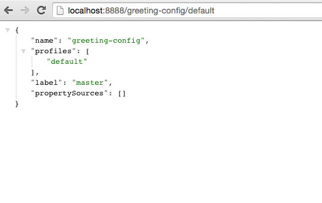

# Spring Cloud Config

<!-- TOC depth:6 withLinks:1 updateOnSave:1 orderedList:0 -->

- [Spring Cloud Config](#spring-cloud-config)
	- [Requirements](#requirements)
	- [What You Will Learn](#what-you-will-learn)
	- [Exercises](#exercises)
		- [Set up the `app-config` Repo](#set-up-the-app-config-repo)
		- [Set up the `cloud-native-app-labs` Repo](#set-up-the-cloud-native-app-labs-repo)
		- [Set up `config-server`](#set-up-config-server)
			- [What Just Happened?](#what-just-happened)
		- [Set up `greeting-config`](#set-up-greeting-config)
			- [What Just Happened?](#what-just-happened)
		- [Changing Logging Levels](#changing-logging-levels)
		- [`@ConfigurationProperties`](#configurationproperties)
		- [`@RefreshScope`](#refreshscope)
		- [Override Configuration Values By Profile](#override-configuration-values-by-profile)
			- [What Just Happened?](#what-just-happened)
		- [Deploy the `config-server` and `greeting-config` apps to PWS](#deploy-the-config-server-and-greeting-config-apps-to-pws)
		- [Cloud Bus](#cloud-bus)
<!-- /TOC -->

## Requirements

[Lab Requirements](https://github.com/pivotal-enablement/cloud-native-app-labs/blob/master/lab-instructions/requirements.md)

## What You Will Learn

* How to set up a git repository to hold configuration data
* How to set up a config server (`config-server`) with a Git backend
* How to set up a client (`greeting-config`) to pull configuration from the `config-server`
* How to change log levels for a running application (`greeting-config`)
* How to use `@ConfigurationProperties` to capture configuration changes (`greeting-config`)
* How to use `@RefreshScope` to capture configuration changes (`greeting-config`)
* How to override configuration values by profile (`greeting-config`)
* How to use Cloud Bus to notify applications to refresh configuration at scale


## Exercises

### Set up the `app-config` Repo
To start, we need a repository to hold our configuration.

1) Fork the configuration repo to your account.  Browse to: https://github.com/pivotal-enablement/app-config.  Then fork the repo.


2) GitHub displays your new fork. Copy the HTTPS clone URL from your fork.

3) Open a new terminal window and clone the fork you just created:

```bash
$ git clone <Your fork of the app-config repo - HTTPS clone URL>
$ cd app-config
```

Notice that this repository is basically empty. This repository will be the source of configuration data.

### Set up the `cloud-native-app-labs` Repo
1) Fork the labs repo to your account.  Browse to: https://github.com/pivotal-enablement/cloud-native-app-labs.  Then fork the repo.

2) GitHub displays your new fork. Copy the HTTPS clone URL from your fork.

3) Open a new terminal window.  Clone the following repo.  This contains several applications used to demonstrate cloud native architectures.  Get familiar with the sub directories.

```bash
$ git clone <Your fork of the cloud-native-app-labs repo - HTTPS clone URL>
$ cd cloud-native-app-labs
```

2) OPTIONAL STEP - Import applications into your IDE such as Spring Tool Suite (STS).  Importing projects at the `cloud-native-app-labs` level is recommended because there are several projects. Otherwise, use your favorite editor.

*STS Import Help:*

Select File > Import... Then select Maven > Existing Maven Projects. On the Import Maven Projects page, browse to your cloud-native-app-labs directory. Make
sure all projects are selected and click Finish.

### Set up `config-server`

1) Review the following file: `$CLOUD_NATIVE_APP_LABS_HOME/config-server/pom.xml`
By adding `spring-cloud-config-server` to the classpath, this application is eligible to embed a config-server.

```xml
<dependency>
    <groupId>org.springframework.cloud</groupId>
    <artifactId>spring-cloud-config-server</artifactId>
</dependency>
```
2) Review the following file:`$CLOUD_NATIVE_APP_LABS_HOME/config-server/src/main/java/io/pivotal/ConfigServerApplication.java`

```java
@SpringBootApplication
@EnableConfigServer
public class ConfigServerApplication {

    public static void main(String[] args) {
        SpringApplication.run(ConfigServerApplication.class, args);
    }
}
```
Note the `@EnableConfigServer` annotation.  That embeds the config-server.

3) Set the Github repository for the `config-server`. This will be the source of the configuration data. Edit the `$CLOUD_NATIVE_APP_LABS_HOME/config-server/src/main/resources/application.yml` file.

```yml
 server:
   port: 8888

 spring:
   cloud:
     config:
       server:
         git:
           uri: https://github.com/d4v3r/app-config.git #<-- CHANGE ME
```
Make sure to substitute your forked app-config repository. Do not use the literal above.

4) Start the `config-server`.

```bash
$ cd $CLOUD_NATIVE_APP_LABS_HOME/config-server
$ mvn clean spring-boot:run
```

Your config-server will be running locally once you see a "Started ConfigServerApplication..." message. You
will not be returned to a command prompt and must leave this window open.

5) Confirm the `config-server` is up and configured with a backing git repository by calling its restful API.  Because the returned payload is JSON, we recommend using something that will pretty-print the document.  A good tool for this is the Chrome [JSON Formatter](https://chrome.google.com/webstore/detail/json-formatter/bcjindcccaagfpapjjmafapmmgkkhgoa?hl=en) plug-in.

Open a browser window fetch the following url: [http://localhost:8888/greeting-config/default](http://localhost:8888/greeting-config/default)



#### What Just Happened?

The `config-server` is a RESTful application. There are several REST based endpoints exposed to fetch configuration.

In this case, we are manually calling one of those endpoints (`/{application}/{profile}[/{label}]`) to fetch configuration.  In this case, we substituted our client application `greeting-config` as the `{application}` and the `default` profile as the `{profile}`.  We didn't specify the label to use so `master` is assumed.  Because there is no configuration in the git repository none is returned.


### Set up `greeting-config`

1) Review the following file: `$CLOUD_NATIVE_APP_LABS_HOME/greeting-config/pom.xml`
By adding `spring-cloud-starter-config` to the classpath, this application will consume configuration from the config-server.  `greeting-config` is a config client.

```xml
<dependency>
    <groupId>org.springframework.cloud</groupId>
    <artifactId>spring-cloud-starter-config</artifactId>
</dependency>
```

2) Review the `$CLOUD_NATIVE_APP_LABS_HOME/greeting-config/src/main/resources/bootstrap.yml`

```yml
spring:
  application:
    name: greeting-config
```
In the bootstrap.yml, `spring.cloud.config.uri` defines how greeting-config reaches the `config-server`. Since there is no `spring.cloud.config.uri` defined in this file, the default value of `http://localhost:8888` is used.  Notice that this is the same host and port of the `config-server` application.

3) Open a new terminal window.  Start the `greeting-config` application:

```bash
$ cd $CLOUD_NATIVE_APP_LABS_HOME/greeting-config
$ mvn clean spring-boot:run
```

4) Confirm the `greeting-config` app is up.  Browse to [http://localhost:8080](http://localhost:8080)  You should see a "Greetings!!!" message.  


#### What Just Happened?

At this point, you connected the `greeting-config` application with the `config-server`.  This can be confirmed by reviewing the logs of the `greeting-config` application.

`greeting-config` log output:
```
2015-09-18 13:48:50.147  INFO 15706 --- [lication.main()] b.c.PropertySourceBootstrapConfiguration :
Located property source: CompositePropertySource [name='configService', propertySources=[]]
```

There is still no configuration in the git repo, but at this point we have everything wired up (`greeting-config` → `config-server` → `app-config` repo) so we can add configuration parameters/values and see the effects in out client application `greeting-config`.

Configuration parameters/values will be added as we move through the lab.

### Changing Logging Levels

Logging levels can be reset with configuration changes.

1) View the getGreeting() method of  `$CLOUD_NATIVE_APP_LABS_HOME/greeting-config/src/main/java/io/pivotal/greeting/GreetingController.java`
 ```java
@RequestMapping("/")
String getGreeting(Model model){

  logger.debug("Adding greeting");
  model.addAttribute("msg", "Greetings!!!");

  if(greetingProperties.isDisplayFortune()){
    logger.debug("Adding fortune");
    model.addAttribute("fortune", fortuneService.getFortune());
  }

  //resolves to the greeting.vm velocity template
  return "greeting";
}
```
We want to see these debug messages.  By default log levels of `ERROR`, `WARN` and `INFO` will be logged.  All log output will be directed to `System.out` & `System.error` by default so logs will be output to the terminal window(s).

2) Edit your fork of the `app-config` repo.  Create a file called `greeting-config.yml`.  Add the content below to the file and push the changes back to GitHub.
```yml
logging:
  level:
    io:
      pivotal: DEBUG

greeting:
  displayFortune: false

quoteServiceURL: http://quote-service-dev.cfapps.io/quote
```
This file has several configuration parameters that will be used throughout this lab.  For this exercise, we have set the log level for classes in `io.pivotal` package to `DEBUG`.

3) While watching the `greeting-config` terminal, refresh the [http://localhost:8080](http://localhost:8080/) url.  No changes in out application logs yet.


4) Does the `config-server` see the change in your git repo?  Let's check what the `config-server` is serving up.  Browse to [http://localhost:8888/greeting-config/default](http://localhost:8888/greeting-config/default)


The value has changed!  The `config-server` has picked up the changes to the git repo.

5) Review the following file: `$CLOUD_NATIVE_APP_LABS_HOME/greeting-config/pom.xml`.  For the `greeting-config` application to pick up the configuration changes, it must be include the `actuator` dependency.  The `actuator` adds several additional endpoints to the application for operational visibility and tasks that need to be carried out.  In this case, we add the dependency to add the `/refresh` endpoint, which allows us to refresh the application config on demand.

```xml
<dependency>
    <groupId>org.springframework.boot</groupId>
  <artifactId>spring-boot-starter-actuator</artifactId>
</dependency>
```

6) For the `greeting-config` application to pick up the configuration changes, it must be told to do so.  Notify `greeting-config` app to pick up the new config by POSTing to the `greeting-config` `/refresh` endpoint.

```bash
$ curl -X POST http://localhost:8080/refresh
```

7) Refresh the `greeting-config` [http://localhost:8080](http://localhost:8080/) url while viewing the `greeting-config` terminal.  You should see the debug line "Adding greeting"


### `@ConfigurationProperties`

Use of `@ConfigurationProperties` is common way to externalize and validate configuration in Spring applications.  `@ConfigurationProperties` beans are automatically rebound when application config is refreshed.

1) Review `$CLOUD_NATIVE_APP_LABS_HOME/greeting-config/src/main/java/io/pivotal/greeting/GreetingProperties.java`.  Use of the `@ConfigurationProperties` annotation allows for reading of configuration values.  Configuration keys are a combination of the `prefix` and the field names.  In this case, there is one field (`displayFortune`).  Therefore `greeting.displayFortune` is used to turn the display of fortunes on/off.  Remaining code is typical getter/setters for the fields.

```java
@ConfigurationProperties(prefix="greeting")
public class GreetingProperties {

	private boolean displayFortune;

	public boolean isDisplayFortune() {
		return displayFortune;
	}

	public void setDisplayFortune(boolean displayFortune) {
		this.displayFortune = displayFortune;
	}
}
```

2) Review `$CLOUD_NATIVE_APP_LABS_HOME/greeting-config/src/main/java/io/pivotal/greeting/GreetingController.java`.  Note how the `greetingProperties.isDisplayFortune()` is used to turn the display of fortunes on/off.  There are times when you want to turn features on/off on demand.  In this case, we want the fortune feature "on" with our greeting.

```java
@EnableConfigurationProperties(GreetingProperties.class)
public class GreetingController {

	Logger logger = LoggerFactory
			.getLogger(GreetingController.class);


	@Autowired
	GreetingProperties greetingProperties;

	@Autowired
	FortuneService fortuneService;

	@RequestMapping("/")
	String getGreeting(Model model){

		logger.debug("Adding greeting");
		model.addAttribute("msg", "Greetings!!!");

		if(greetingProperties.isDisplayFortune()){
			logger.debug("Adding fortune");
			model.addAttribute("fortune", fortuneService.getFortune());
		}

		//resolves to the greeting.vm velocity template
		return "greeting";
	}


}

```


3) Edit your fork of the `app-config` repo.   Change `greeting.displayFortune` from `false` to `true` in the `greeting-config.yml` and push the changes back to GitHub.

```yml
logging:
  level:
    io:
      pivotal: DEBUG

greeting:
  displayFortune: true

quoteServiceURL: http://quote-service-dev.cfapps.io/quote
```

4) Notify `greeting-config` app to pick up the new config by POSTing to the `/refresh` endpoint.

```bash
$ curl -X POST http://localhost:8080/refresh
```

5) Then refresh the [http://localhost:8080](http://localhost:8080/) url and see the fortune included.

### `@RefreshScope`

Beans annotated with the  `@ResfreshScope` will be recreated when refreshed so they can pickup new config values.

1) Review `$CLOUD_NATIVE_APP_LABS_HOME/greeting-config/src/main/java/io/pivotal/quote/QuoteService.java`.  `QuoteService.java` uses the `@RefreshScope` annotation. Beans with the `@RefreshScope` annotation will be recreated when refreshing configuration.  The `@Value` annotation allows for injecting the value of the quoteServiceURL configuration parameter.

In this case, we are using a third party service to get quotes.  We want to keep our environments aligned with the third party.  So we are going to override configuration values by profile (next section).

```java
@Service
@RefreshScope
public class QuoteService {
	Logger logger = LoggerFactory
			.getLogger(QuoteController.class);

	@Value("${quoteServiceURL}")
	private String quoteServiceURL;

	public String getQuoteServiceURI() {
		return quoteServiceURL;
	}

	public Quote getQuote(){
		logger.info("quoteServiceURL: {}", quoteServiceURL);
		RestTemplate restTemplate = new RestTemplate();
		Quote quote = restTemplate.getForObject(
				quoteServiceURL, Quote.class);
		return quote;
	}
}
```


2) Review `$CLOUD_NATIVE_APP_LABS_HOME/greeting-config/src/main/java/io/pivotal/quote/QuoteController.java`.  `QuoteController` calls the `QuoteService` for quotes.

```java
@Controller
public class QuoteController {

	Logger logger = LoggerFactory
			.getLogger(QuoteController.class);

	@Autowired
	private QuoteService quoteService;

	@RequestMapping("/random-quote")
	String getView(Model model) {

		model.addAttribute("quote", quoteService.getQuote());
		model.addAttribute("uri", quoteService.getQuoteServiceURI());
		return "quote";
	}
}
```

3) In your browser, hit the [http://localhost:8080/random-quote](http://localhost:8080/random-quote) url.  
Note where the data is being served from: `http://quote-service-dev.cfapps.io/quote`

### Override Configuration Values By Profile

1) Stop the `greeting-config` application

2) Set the active profile to qa for the `greeting-config` application.  In the example below, we use an environment variable to set the active profile.

```bash
$ SPRING_PROFILES_ACTIVE=qa mvn clean spring-boot:run
```
2) Make sure the profile is set by browsing to the [http://localhost:8080/env](http://localhost:8080/env) endpoint (provided by `actuator`).  Under profiles `qa` should be listed.


3) In your fork of the `app-config` repository, create a new file: `greeting-config-qa.yml`. Fill it in with the following content:

```yml
quoteServiceURL: http://quote-service-qa.cfapps.io/quote
```
Make sure to commit and push to GitHub.

4) Refresh the application configuration values

```bash
$ curl -X POST http://localhost:8080/refresh
```

5) Refresh the [http://localhost:8080/random-quote](http://localhost:8080/random-quote) url.  Quotes are now being served from QA.  
when done stop both the `config-server` and `greeting-config` applications.

#### What Just Happened?

Configuration from `greeting-config.yml` was overridden by a configuration file that was more specific (`greeting-config-qa.yml`).

### Deploy the `config-server` and `greeting-config` apps to PWS

1) Package and deploy the `config-server` to PWS.  The `--random-route` flag will generate a random uri for the `config-server`.  Make note of it.  You will use it in the next step. Make sure you are targeting your PWS account and execute the following from
the `config-server` directory:

```bash
$ mvn clean package
$ cf push config-server -p target/config-server-0.0.1-SNAPSHOT.jar -m 512M --random-route
```

2) Create a user-provided service.  This service describes how to connect to your `config-server` application.  Make sure to use your config-server uri, not the literal below.

```bash
$ cf cups config-server -p uri
$ uri> http://config-server-sectarian-flasket.cfapps.io
```

3) Add the following to `$CLOUD_NATIVE_APP_LABS_HOME/greeting-config/src/main/resources/bootstrap.yml`.

```yml
spring:
  application:
    name: greeting-config
  cloud:  # <-- ADD NEW SECTION
    config:
      uri: ${vcap.services.config-server.credentials.uri:http://localhost:8888}
```
When defining the `spring.cloud.config.uri`, our app will first look for an environment variable (`vcap.services.config-server.credentials.uri`). If it is not present, it will try to connect to the local `config-server`.

4) Package the `greeting-config` application. Execute the following from the `greeting-config` directory:

```bash
$ mvn clean package
```

5) Deploy the `greeting-config` application to PWS, without starting the application:

```bash
$ cf push greeting-config -p target/greeting-config-0.0.1-SNAPSHOT.jar -m 512M --random-route --no-start
```
6) Bind the `config-server` service to the `greeting-config` app. This will enable the `greeting-config` app to read
configuration values from the `config-server`.

```bash
$ cf bind-service greeting-config config-server
```

7) Start the `greeting-config` app. The proper environment variables will be set.  You can safely ignore the _TIP: Use 'cf restage' to ensure your env variable changes take effect_ message from the CLI.  Our app doesn't need to be restaged but just started.

```bash
$ cf start greeting-config
```

8) Browse to your `greeting-config` application.  Are your configuration settings that were set when developing locally mirrored on PWS?

* Is the log level for `io.pivotal` package set to `DEBUG`?  Yes, this can be confirmed with `cf logs` command while refreshing the `greeting-config` `/` endpoint.
* Is `greeting-config` app displaying the fortune?  Yes, this can be confirmed by visiting the `greeting-config` `/` endpoint.
* Is the `greeting-config` app serving quotes from `http://quote-service-qa.cfapps.io/quote`?  No, this can be confirmed by visiting the `greeing-config` `/random-quote` endpoint.  Why not?  When developing locally we used an environment variable to set the active profile, we need to do the same on PWS.

```bash
$ cf set-env greeting-config SPRING_PROFILES_ACTIVE qa
$ cf restart greeting-config
```
You can safely ignore the _TIP: Use 'cf restage' to ensure your env variable changes take effect_ message from the CLI.  Our app doesn't need to be restaged but just re-started.

Then confirm quotes are being served from ``http://quote-service-qa.cfapps.io/quote``

### Cloud Bus

Until now you have been notifying your application to pickup new configuration by POSTing to the `/refresh` endpoint.

When running several instances of your application this poses several problems:

* Refreshing each individual instance is time consuming and too much overhead
* When running on Cloud Foundry you don't have control over which instances you hit when sending the POST request due to load balancing provided by the `router`

Cloud Bus addresses the issues listed above by providing a single endpoint to refresh all application instances via a pub/sub notification.

1) Scale the number of `greeting-config` instances to 3

```
$ cf scale greeting-config -i 3
```

2) Create a RabbitMQ service instance, bind it to `greeting-config`
```bash
$ cf cs cloudamqp lemur cloud-bus
$ cf bs greeting-config cloud-bus
```

3) Include the cloud bus dependency in the  `$CLOUD_NATIVE_APP_LABS_HOME/greeting-config/pom.xml`.  _You will need to paste this in your file._
```xml
<dependency>
    <groupId>org.springframework.cloud</groupId>
    <artifactId>spring-cloud-starter-bus-amqp</artifactId>
</dependency>
```

4) Repackage the `greeting-config` application:
```bash
$ mvn clean package
```

5) Deploy the application
```bash
$ cf push greeting-config -p target/greeting-config-0.0.1-SNAPSHOT.jar
```

6) Observe the logs that are generated by refreshing the `greeting-config`
`/` endpoint several times in your browser.

```bash
$ cf logs greeting-config | grep GreetingController
```

All app instances are creating debug statements:

```
2015-09-28T20:53:06.07-0500 [App/2]      OUT 2015-09-29 01:53:06.071 DEBUG 34 --- [io-64495-exec-6] io.pivotal.greeting.GreetingController   : Adding fortune
2015-09-28T20:53:06.16-0500 [App/1]      OUT 2015-09-29 01:53:06.160 DEBUG 33 --- [io-63186-exec-5] io.pivotal.greeting.GreetingController   : Adding greeting
2015-09-28T20:53:06.16-0500 [App/1]      OUT 2015-09-29 01:53:06.160 DEBUG 33 --- [io-63186-exec-5] io.pivotal.greeting.GreetingController   : Adding fortune
2015-09-28T20:53:06.24-0500 [App/1]      OUT 2015-09-29 01:53:06.246 DEBUG 33 --- [io-63186-exec-9] io.pivotal.greeting.GreetingController   : Adding greeting
2015-09-28T20:53:06.24-0500 [App/1]      OUT 2015-09-29 01:53:06.247 DEBUG 33 --- [io-63186-exec-9] io.pivotal.greeting.GreetingController   : Adding fortune
2015-09-28T20:53:06.41-0500 [App/0]      OUT 2015-09-29 01:53:06.410 DEBUG 33 --- [io-63566-exec-3] io.pivotal.greeting.GreetingController   : Adding greeting
```

7) Turn logging down.  In your fork of the `app-config` repo edit the `greeting-config.yml`.  Set the log level to `INFO`.
```yml
logging:
  level:
    io:
      pivotal: INFO
```

8) Notify applications to pickup the change.  Send a POST to the `greeting-config` `/bus/refresh` endpoint.  Use your url not the literal below.
```bash
$ curl -X POST http://greeting-config-hypodermal-subcortex.cfapps.io/bus/refresh
```

9) Refresh the `/` endpoint several times in your browser.  No more logs!
