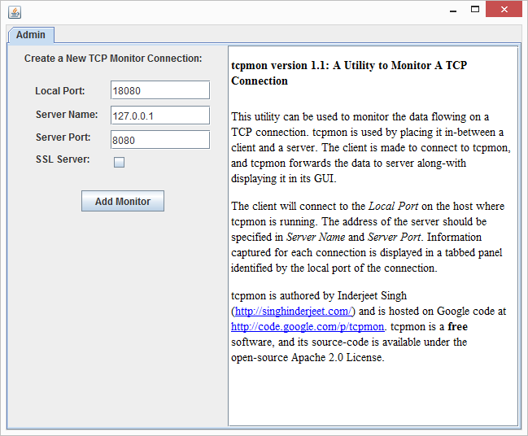
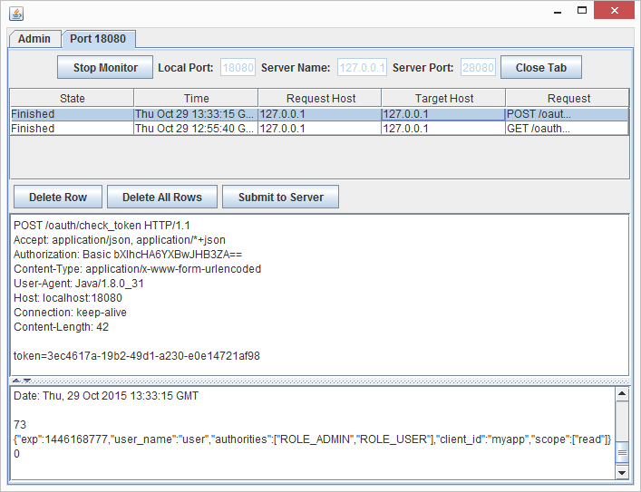
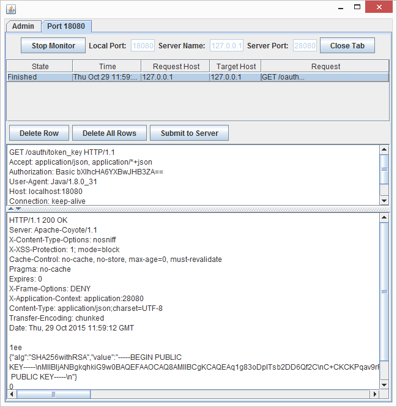

<!--<span id="anchor"></span>Spring Cloud Native Apps Course Labs-->

# <span id="anchor-1"></span>Micro-Services Security with Spring Security, OAuth2 & UAA

In this lab, you will learn how to use Spring Security, OAuth2, and UAA server to secure cloud-native application and 
micro-services architectures.

**In this lab you will learn:**

- How to configure an Authentication/Authorization server based on Spring OAuth2 to issue Tokens (opaque and JWT)
- How to create a Resource server that exposes a REST-WS API that is protected to required OAuth2 Token credentials
- How to create a client application that consumes a REST-WS that required OAuth2 Tokens
- How to experiment replace a custom Authentication Server in a security architecture with a standalone UAA server

**Specific techniques you will work with:**

- Use annotation `@EnableAuthorization`, Spring Boot external configuration, and Java Config of Spring OAuth2 to configure the Authorization server
- Use annotation `@EnableResourceServer`, Spring Boot external configuration, and Java Config to protected a REST-WS to require OAuth2 Bearer token authentication
- Use annotation `@EnableOAuth2Client`, Spring Boot external configuration, and Java Config of Spring OAuth2 to consume an OAuth2 Token protected REST-WS
- Use `curl` command-line tool to experiment with the endpoints of the OAuth2 Authorization and Resource servers
- Start UAA as a local standalone server as an out-of-the-box OAuth2 Authorization server
- **\[OPTIONAL\]** Troubleshoot OAuth2 interactions with a TCP/IP standalone monitor

<!--
- **\[BONUS\]** Setup a method-level security policy based on OAuth2 scopes
- **\[BONUS\]** Deploy UAA to PWS Cloud-Foundry
-->

Expected time duration to complete the lab: 15min(auth server) + 10min(resource server) + 10min(client app) + 10min(UAA)= 45min

## Architecture for this Lab

The distributed system you are going to setup In this lab is made out of three processes – an Authorization server, 
a Resource server with a REST-WS API, and a Client Application (e.g. such as a standalone non-web application, a Web UI Gateway, or a REST-WS Gateway).
The Authorization server is used to issue OAuth2 security Tokens to the Client Application. 
The Client application uses this Token (as a Bearer Token) to access the protected REST-WS served by the Resource server.

## <span id="anchor-2"></span>**Configure Authorization Server**

In the provided lab workspace, you can find project `cna-0x-security-authserver`. 
Most dependencies have already been setup in the Maven project descriptor file (`pom.xml`). 
(This was done with the help of Spring Starter.) 
The project should import the dependencies for Spring Security Boot Starter, Spring OAuth2, and support for JWT token. 
You first step is to import these dependencies.

### <span id="anchor-3"></span>TODO 1 - Import Maven Dependencies for Spring Security OAuth2

Start by importing the Maven dependencies for Spring Security Boot Starter, Spring OAuth2, and support for JWT token.

1. Add the dependencies below to the `pom.xml` file of project `cna-0x-security-authserver`.

```XML
<!-- Boot Starter for Spring Security -->
<dependency>
	<groupId>org.springframework.Boot</groupId>
	<artifactId>spring-Boot-starter-security</artifactId>
</dependency>		
		
<!-- for OAuth 2.0 -->
<dependency>
	<groupId>org.springframework.security.oauth</groupId>
	<artifactId>spring-security-oauth2</artifactId>
</dependency>
        
<!-- for JWT Tokens -->
<dependency>
	<groupId>org.springframework.security</groupId>
	<artifactId>spring-security-jwt</artifactId>
</dependency>
```

**TIP:** Note that is not required to specify the `<version>` element for the dependencies, since they are setup automatically in the pom file for 
`spring-bom` (indirectly through `spring-Boot-starter-parent`).

**TIP:** Maven should automatically update your project dependencies. If not, use option **Maven &gt; Update Project (ALT + F5)** from the context menu.

### <span id="anchor-4"></span>TODO 2a – Register Singleton Client in Authorization Server

Spring Boot simplifies the configuration of Spring Security and Spring OAuth2 in a variety of ways. You can leverage the external configuration setting supported by Boot to get the Authorization up&running quickly. Start by registering a singleton client in the Authorization server using Boot properties.

Open file `application.properties`, under source folder `src/main/resources`, and specify the settings to register a single client application.

1. Set properties with prefix `security.oauth2.client.*`, including `clientId=myapp`, `clientSecret=app$pwd`, and `scope=read`.

```properties
security.oauth2.client.clientId = myapp
security.oauth2.client.clientSecret = app$pwd
security.oauth2.client.scope=read
```

### TODO 2b – Protected Token Granting Endpoints

Access to Token granting endpoints of the Authorization server should be protected to require authentication. 
The simplest way to setup this is to specify credentials for a singleton user and let Spring Boot configure Spring Security to require BASIC authentication.

2. Set properties with prefix `security.user.*`, with `name=user`, `password=user$pwd`.

```properties
security.user.name=user
security.user.password=user$pwd
```


### <span id="anchor-5"></span>TODO 3 – Enable Authentication Server Auto-Configuration

You need to explicitly instruct Spring Boot to enable auto-configuration of Spring OAuth2 
(e.g. to enable token endpoints and to create&register the singleton Client). 
This can be done simply with annotation `@EnableAuthorizationServer`.

Open config class `OAuth2Config.java`, under package `io.cna.config` (under source directory tree `src/main/java`).

1. Enable Boot auto-configuration of Spring OAuth2 with annotation `@EnableAuthorizationServer`

### <span id="anchor-6"></span>TODO 4 – Start Authorization Server & Experiment with Endpoints

Now start the Authorization server from the IDE (**Run As &gt; Spring Boot App**). 
Confirm that the server start without errors and listens on the Boot default http/tcp port `8080`.
 (Use the console log for this.)

Check that the Authorization server is able to produce tokens by using `curl` tool.

1. Use `curl` to `POST` a HTTP request to URI `localhost:8080/oauth/token` with BASIC authentication credentials `app:app$pwd`, 
and the following form parameters: `grant_type=password`, `username=user`, `password=user$pwd`, and `scope=read`. 
Confirm that the access token is returned as a field in the reply.

```properties
curl myapp:app$pwd@localhost:8080/oauth/token -d grant_type=password -d username=user -d password=user$pwd -dscope=read
```

**TIP:** You can assign the returned access token to an environment variable, to make it easier to reuse it later on. 
Cut&paste the field `accessToken` from the JSON reply.

```bash
[Window]
set TOKEN=xxxx
echo %TOKEN%
```
```bash
[Linux/Mac]
export TOKEN=xxxx
echo $TOKEN
```

### TODO 5a – Allow Access to Token Validation Endpoint in Authorization Server

By default the Authorization server does not give access to the token validation endpoint.
 To allow a Resource server to use the endpoint, you need to change the security policy.

Open config file `OAuth2Config`, in package `io.cna.config`.

1. Modify the implementation of method `configure(AuthorizationServerSecurityConfigurer)` by calling `security.checkTokenAccess()`. 
Use a security SPEL expression `"isAnonymous() || isAuthenticated()"`.

```java
@Override
public void configure(AuthorizationServerSecurityConfigurer security) throws Exception {
	super.configure(security);
	security.realm(REALM);
	security.checkTokenAccess("isAnonymous() || isAuthenticated()")
}
```


### TODO 5b – Experiment with Token Validation Endpoint

Check that the Authorization server is able to validate the issued access tokens.

1. Use `curl` to `POST` a HTTP request to URI `localhost:8080/oauth/check_token` with the token value as form parameter named `token`.
 Confirm that the token is validated.

```bash
curl localhost:8080/oauth/check_token -d token=xxxx
```

## <span id="anchor-7"></span>**Configure Resource Server to Protect REST-WS API**

Your Resource server implements a REST-WS API that you what to protect by requiring OAuth2 Bearer Tokens authentication. 
Open project `cna-0x-security-resourceserver`, and review class `InfoRestController`, under package `io.cna.web.service`. 
Notice that it exposes endpoint `/service/info/env`.

### TODO 6 - Import Maven Dependencies for Spring Security OAuth2

To setup OAuth2 security in the Resource server you need to import the same Maven dependencies that you imported for the Authorization server. Namely: Spring Security Boot Starter, Spring OAuth2, and support for JWT token.

1. Add to the `pom.xml` file of project `cna-0x-security-resourceserver` the same dependencies that you added earlier to project `cna-0x-security-authserver`.

**TIP:** Cut&Pasting the respective fragment of the `pom.xml` from project `cna-0x-security-authserver` is the fastest way to complete this step.

### TODO 7a – Config Token Validation Endpoint in Resource Server

To validate (a non JWT) token, a Resource server needs to know the location of the token check endpoint in the Authorization server.

Open file `application.properties`, under source folder `src/main/resources`, and specify the endpoint to validate a token.

1. Set property `security.oauth2.resource.tokenInfoUri` to point to the `/oauth/check_token` endpoint of the Authorization server.

```properties
security.oauth2.resource.tokenInfoUri=http://localhost:8080/oauth/check_token
```

### TODO 7b – Configure Singleton Client in Resource Server

Spring Boot OAuth2 auto-configuration also requires the registration of a client in the Resource Server.
Specify the settings to register a single client application.

1. Set properties with prefix `security.oauth2.client.*`, including `clientId=myapp`, `clientSecret=app$pwd`, and `scope=read`.

```properties
security.oauth2.client.clientId = myapp
security.oauth2.client.clientSecret = app$pwd
security.oauth2.client.scope=read
```

### TODO 7c – Further Configuration of Resource Server

Since the Authorization Server is already running in port 8080, you need to configure the Resource server to run in a different port.

1. In file `application.properties`, set property `server.port=8081`.

```properties
server.port=8081
```

### <span id="anchor-8"></span>TODO 8 – Enable Resource Server Auto-Configuration

You need to explicitly instruct Spring Boot to enable auto-configuration of Spring OAuth2 also in the Resource server. This can be done simply with annotation `@EnableResourceServer`.

Open main class `ResourceServerApplication.java`, under the root package `io.cna` (in source directory tree `src/main/java`).

1. Enable Boot auto-configuration of Spring OAuth2 with annotation `@EnableResourceServer`

### <span id="anchor-9"></span>TODO 9 – Start Resource Server & Experiment with Endpoints

Now start the Resource server from the IDE (**Run As &gt; Spring Boot App**). Confirm that the server start without errors and listens on the Boot http/tcp port 8081.

Use the `curl` tool to check that the Resource server allows access to endpoint `/service/info/env`, *if and only if*, 
an appropriate *Bearer Token* is provided in the HTTP header Authorization.

1. Use `curl` to retrieve resource served under endpoint `/service/info/env`, with bearer token credentials and the token retrieved earlier. 
Make sure that the token has not expired yet. If so, issue another one.
2. Modify the token, or make a request without a token, a confirm that the access is denied.

```bash
curl localhost:8081/service/info/env -H "Authorization: Bearer xxxx"
```

If you saved the token as an environmennt variable, say named `TOKEN`, you use it now (rather than inlining the token):

```bash
[Windows]
curl localhost:8081/service/info/env -H "Authorization: Bearer %TOKEN%"
```
```bash
[Linux/Mac]
curl localhost:8081/service/info/env -H "Authorization: Bearer $TOKEN"
```

### \[OPTIONAL\] TODO 9b – Troubleshooting with stanalone TCP/IP monitor  <span id="anchor-9"></span>

If you need to troubleshoot any issue and/or you want to know the details of the request made by Resource server to the Authorization server,
you can use a standalone TCP/IP monitor.

1. Download TCP/IP standalone monitor **tcpmon** from link: http://archive.apache.org/dist/ws/tcpmon/1.0/tcpmon-1.0-bin.zip
2. Unzip the file to extract the JAR file inside
3. Start **tcpmon** as shown below:

```bash
java -cp tcpmon-1.1.jar com.codegoogle.tcpmon.MainWindow
```

4. Configure **tcpmon** to listen on port `18080` and forward requests to port `8080`
5. Change the configuration of property `security.oauth2.resource.tokenInfoUri` to use port `18080`. Restart the Resource server.
6. Use `curl` again to retrieve resource in endpoint  `localhost:8081/service/info/env` with the bearer token
7. Confirm with **tcpmon** that the endpoint  `localhost:8080/oauth/check_token` was invoked


<!---->
<!-- -->




## Create Resource Consumer App

Rather than simply use `curl` tool to test the Authorization and Resource server, you also want to create a client application that consumes the 
protected REST-WS using the OAuth2 Tokens as credentials. 
Two simple application have already been provide for you in project `cna-0x-security-client`: `ClientApplication`, 
which is a non-web standalone Boot application, and `ClientWebApplication` which runs as a web-application (with an embedded Servlet container, as a server).
Your goal is to make these applications consume the OAuth2 protected REST-WS API provided by the Resource server.
In this section you focus only on the standalone non web-app.
In an optional bonus section, you can work on the client web-app. 

### TODO 10 - Import Maven Dependencies for Spring Security OAuth2

To setup OAuth security in a client application you need to import the same Maven dependencies that you imported for the Authorization and Resource server. 
Namely: Spring Security Boot Starter, Spring OAuth2, and support for JWT token.

1. Add to the `pom.xml` file of project `cna-0x-security-client` the same dependencies that you added earlier to project `cna-0x-security-authserver`.

**TIP:** Cut&Pasting the respective fragment of the `pom.xml` from project `cna-0x-security-authserver` is the fastest way to complete this step.

### TODO 11 – Define Resource Details and OAuth2RestTemplate

To perform REST requests authenticated with an OAuth2 token you need to define a descriptor for the remote protected resource. For tokens issued with a user password grant the descriptor is of type `ResourceOwnerPasswordResourceDetails`.

In class OAuthConfig, define and initialize a bean as follows:

1. Define a method named `resource()` that returns a `ResourceOwnerPasswordResourceDetails`
2. Implement by simple creating and returning an instance of `ResourceOwnerPasswordResourceDetails`
3. Annotated the method with `@Bean`
4. Perform external configuration of the returned object with annotation `@ConfigurationProperties` and prefix `security.oauth2.client`.


```java
@Bean
@ConfigurationProperties("security.oauth2.client")
public ResourceOwnerPasswordResourceDetails resource() {
	return new ResourceOwnerPasswordResourceDetails();
}
```


### TODO 12 – Configure Resource Details

Since the configuration of the ResourceDetails was externalized you need to define the resource configuration. Open file `application.properties`, under source folder `src/main/resources`:

1. Set properties with prefix `security.oauth2.client.*`, including `clientId=myapp`, `clientSecret=app$pwd`, and `scope=read`.
2. Set also the URI for the endpoint to retrieve the OAuth2 token with `accessTokenUri` pointing to the endpoint `/oauth/token` of the Authorization server.
3. For user password grant type you also need to set properties `username=user` and `password=user$pwd`.

```properties
security.oauth2.client.clientId = myapp
security.oauth2.client.clientSecret = app$pwd
security.oauth2.client.scope=read
security.oauth2.client.accessTokenUri= http://localhost:8080/oauth/token
security.oauth2.client.userAuthorizationUri= http://localhost:8080/oauth/authorize
security.oauth2.client.username=user
security.oauth2.client.password=user$pwd
security.basic.enabled: false
```

4. Since authentication is being done in the remote resource you can disable BASIC authentication usually auto-configured by Spring Boot by 
setting `security.basic.enabled= false`.

```properties
security.basic.enabled= false
```

### TODO 13 – Define OAuth2RestTemplate

To consume a REST-WS protected with OAuth2 you also need to define a bean of type `OAuth2RestTemplate`. Define the bean in class OAuthConfig as follows:

1. Define a method named `restTemplate()` that returns a `Oauth2RestTemplate`, and takes two parameters one of type `OAuth2ClientContext` and another of type `ResourceOwnerPasswordResourceDetails`
2. Implement by simple creating and returning an instance of `OAuth2RestTemplate` passing the two parameters to the constructor
3. Annotated the method with `@Bean`

```java
@Bean
public OAuth2RestTemplate restTemplate(ResourceOwnerPasswordResourceDetails resource, OAuth2ClientContext context)  {
	return new OAuth2RestTemplate(resource, context);
}
```

### TODO 14 – Enable OAuth Client Auto-Configuration

To have Spring Boot auto-configure some required beans such as `OAuth2ClientContext` you need to use annotation `@EnableOAuth2Client`. 
Open class `ClientApplication.java`, under the root package` io.cna `(in source directory tree `src/main/java`).

1. Enable Boot auto-configuration of Spring OAuth2 with annotation `@EnableOAuth2Client`

### TODO 15 – Test Client Application

You can now test the client application. Open class `ClientApplication` and notice that a OAuth2RestTemplate field is being injected. Complete the body of the main method to invoke the remote resource.

1. Invoke method getForObject() on the URI of the endpoint `/service/info/env` of the Resource server REST-WS API, and retrieve the value as type `String`.
Print the resulting object.
2. Run the application (**Run As &gt; Spring Boot App**) and confirm that the remote invocation is completed with success.

```java
String r = app.template.getForObject("http://localhost:8081/service/info/env", String.class);
System.out.println(r);
```

## Configure Authorization Server to Use JWT Tokens

So far the OAuth2 tokens issued by the Authentication server are opaque identifiers (UIDs), 
which require the Resource server to contact the Authorization server to validate the token. 
An alternative approach is to issue self-described JWT tokens that can be validated locally by thee Resource server.

### TODO 16 – Configure JWT Token Store and Converter in Authorization Server

To enable JWT Tokens in the Authorization server you need to define a bean of type `JwtAccessTokenConverter` and another of type `JwtTokenStore`. 
Start by opening file `application.yml` and notice that two properties have already been defined with a private–public key–pair.

Open class file `OAuth2Config`, and define a bean of type `JwtAccessTokenConverter`, as follows:

1. Define method named `accessTokenConverter()` that returns a value of type `JwtAccessTokenConverter`.
2. Implement by creating an instance of `JwtAccessTokenConverter`
3. Initialize the value of properties `signingKey` and `verifierKey` from the `privateKey` and `publicKey` properties of bean `key()`.
4. Annotated method with `@Bean`

```java
@Bean
public JwtAccessTokenConverter accessTokenConverter() {
	JwtAccessTokenConverter converter = new JwtAccessTokenConverter();
	Key key = key();
	converter.setSigningKey(key.getPrivateKey());
	converter.setVerifierKey(key.getPublicKey());
	return converter;
}
```

**TIP:** Notice that bean `key()` is being externally configured with the private–public key–pair.

Define next a bean of type `JwtTokenStore`, as follows:

1. Define method named `tokenStore()` that returns a value of type `TokenStore`.
2. Implement by creating and returning an instance of `JwtTokenStore`, and passing bean `accessTokenConverter()` as argument
3. Annotated method with `@Bean`

```java
@Bean
public TokenStore tokenStore() {
	return new JwtTokenStore(accessTokenConverter());
}
```

Next configure the Spring OAuth2 runtime to use the `tokenStore()` and `accessTokenConverter()` beans.

1. Modify the implementation of method `configure(AuthorizationServerEndpointsConfigurer)` by calling `endpoints.tokenStore()` and `tokenEnhancer()` passing the two defined beans as argument.

```java
@Override
public void configure(AuthorizationServerEndpointsConfigurer endpoints) throws Exception {
	super.configure(endpoints);
	endpoints.tokenStore(tokenStore()).tokenEnhancer(accessTokenConverter());
}
```

### TODO 17 – Test Generation of JWT Token

Restart the Authorization server from the IDE. 
(**TIP:** In STS/Eclipse IDE you can use the Relaunch button for this.)
Confirm that the server restarts without errors.

Check next that the Authorization server is able to produce JWT tokens by using `curl` tool.

1. Use `curl` to `POST` a HTTP request to URI `localhost:8080/oauth/token` with BASIC authentication credentials `app:app$pwd`,
 and the following form parameters: `grant_type=password`, `username=user`, `password=user$pwd`, and `scope=read`. 
 Confirm that the JWT access token is returned as a field in the reply.

```bash
curl myapp:app$pwd@localhost:8080/oauth/token -d grant_type=password -d username=user -d password=user$pwd -dscope=read
```

You can also decode the content of the JWT token.

1. Open in your browser window/tab in a location for a JWT token decoder application such as: http://calebb.net/ or http://jwt.io/.

2. Cut the JWT token issued by the Authorization Server and past it to the JWT token decoder application.

3. Inspect the decoded result and try to identify the meaning of some of the field.

You can also use `curl` on `/oauth/token_key` endpoint of the Authorization server to get the public key is used by the Resource server to verify the 
integrity of the JWT Token signature.


```bash
curl localhost:8080/oauth/token_key
```

## Configure Resource Server to Use JWT Tokens

Configuring the Resource server to use and validate JWT tokens is straigtfoward with the help of Spring Boot auto-configuration. 

### TODO 18 – Configure Resource Server for JWT Tokens

Open file `application.properties` of project `cna-0x-security-resourceserver`.

1. Define property `security.oauth2.resource.jwt.keyUri` to point to the `/oauth/token_key` of the Authorization server.

2. Comment property `security.oauth2.resource.tokenInfoUri`.

```properties
security.oauth2.resource.jwt.keyUri=http://localhost:8080/oauth/token_key
#security.oauth2.resource.tokenInfoUri=http://localhost:8080/oauth/check_token
```

Now restart the Resource server from the IDE.
Confirm that the server restarts without errors.


### \[OPTIONAL\] TODO 18b – Troubleshooting with stanalone TCP/IP monitor  <span id="anchor-9"></span>

If you have installed **tcpmon**, you can also confirm that on restart the Resource server invokes endpoint `/oauth/token_key` of the Authorization server.
For this, you need to change the configuration of property `security.oauth2.resource.jwt.keyUri` to use port `18080`. (If you have not done yet.)

<!-- -->


### TODO 19 – Access Protected REST-WS in Resource Server with JWT Bearer Tokens

Use the `curl` tool, to check that the Resource server allows access to endpoint `/service/info/env`, *if and only if*, 
an appropriate JWT *Bearer Token* is provided in the HTTP header Authorization.

1. Use `curl` to retrieve resource served under endpoint `/service/info/env`, with bearer token credentials and the JWT token retrieved earlier. 
2. Modify the token, or make a request without a token, a confirm that the access is denied.

```bash
curl localhost:8081/service/info/env -H "Authorization: Bearer xxxx"
```

If you saved the JWT token as an environmennt variable, say named `TOKEN`, you use it now (rather than inlining the token):

```bash
[Windows]
curl localhost:8081/service/info/env -H "Authorization: Bearer %TOKEN%"
```
```bash
[Linux/Mac]
curl localhost:8081/service/info/env -H "Authorization: Bearer $TOKEN"
```


## Run UAA Standalone Server

Rather than configure and run your own OAuth2 Authorization server, you can also use an out-of-box feature-rich server such as UAA project –
part of Cloud-Foundry, but that can also be used standalone.

### TODO 20 – Build and Run local UAA Standalone Server
 
Start by shutdown your custom OAuth2 server listening on port 8080 (if it is still running). 
Proceed to download, configure, build, and run UAA from the github repository.

```properties
git clone https://github.com/cloudfoundry/uaa.git
cd uaa
./gradlew run
```

**TIP:** To avoid the build to timeout open file `gradle.build` as add setting `timeout=99999999` as field under section `cargo local`.


```json
cargo {
	containerId = 'tomcat7x'
	port = 8080
	local {
		timeout=99999999
		...
	}
}
```

Once the UAA server is up&running (it can take a while) you can test interacting with it, in a similar way you did before for your
custom OAuth2 Authorization server. 

### TODO 21 – Retreive JWT Token from UAA Standalone Server

Ask the UAA server to issue a JWT signed token using the `curl` tool. 
Notice that the endpoints for the UAA standalone server have prefix `/uaa/`.
Also the credentials for the default singleton user and singleton client are different. 

1. Use `curl` to `POST` a HTTP request to URI `localhost:8080/uaa/oauth/token` with BASIC authentication credentials `app:appclientsecret`,
and the following form parameters: `grant_type=password`, `username=marissa`, `password=koala`, and `scope=read`.
Confirm that the JWT access token is returned as a field in the reply.

<!--
```bash
curl -u "app:appclientsecret" http://localhost:8080/uaa/oauth/token -d"username=marissa&password=koala&client_id=app&grant_type=password&scope=read" 
```
-->
```bash
curl -u "app:appclientsecret" http://localhost:8080/uaa/oauth/token -d username=marissa -d password=koala -d client_id=app -d grant_type=password -d scope=read
```

You can decode the content of the JWT token, as before, using websites: http://calebb.net/ or http://jwt.io/


You can also use `curl` on `/uaa/oauth/token_key` endpoint of the Authorization server to get the public key used to signed the JWT Tokens.
This endpoint is invoked by the Resource server on bootstrap, and the key is used to verify the integrity of the JWT Token signature.

```bash
curl localhost:8080/uaa/oauth/token_key
```

## \[BONUS\] Method-Level Security with OAuth2 Scopes

...on progress/future work...

## \[BONUS\] Create Resource Consumer Web-App

...on progress/future work...

## \[BONUS\] Deploy Standalone UAA to PCF

...on progress/future work...
